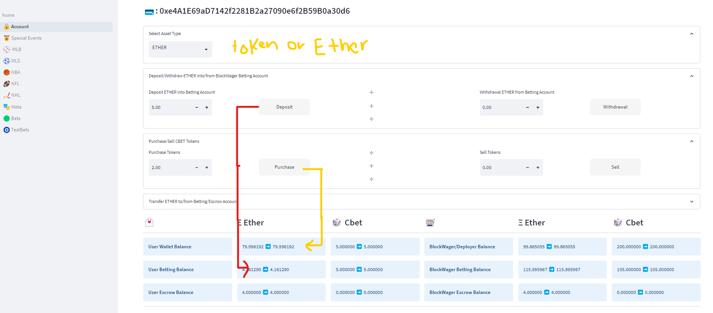
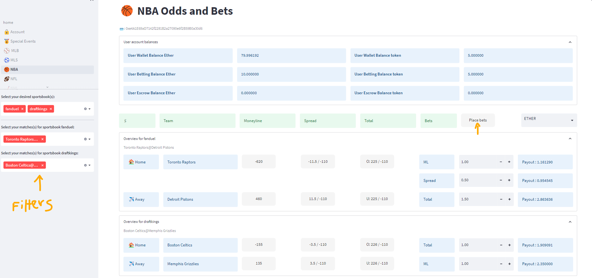

# BlockWager

---
# Columbia University Engineering, New York FinTech Bootcamp - August 2022 Cohort Capstone
---

## BlockWager
**The Future of Decentralized Betting - a blockchain-powered sports betting service.**  

The betting industry is monopolized by a few large sports betting behemoths.  Blockager is a decentralized, transparent platform that allows customers to control their funds without third-party interference.  Each transaction is governed by a smart contract.  Through our blockchain, players can break out of the traditional ways of betting and improving their gaming experience.

- BlockWager Advantages
    - Transparency: As a public ledger on the blockchain, our app is able to unequivically prove operational fairness by recording all gaming activity - including payouts, wins, and losses, that is transparent and immutable. This eliminates the risk of fraud and ensures fairness.  The use of smart contracts to facilitate this process also eliminates the need for 3rd party intermediaries.
    - Value Transfer: Transact in crypto instead of fiat currencies without providing sensitive banking invormation like a credit card..  Our app provides betting with Ethereum and our own custom CBET coins/tokens.  Our coins facilitate rapid payouts with near-instantaneous settlement periods.
    - Accessibility: As our application is on a decentralized network, it is inherently censorship-resistant since the underlying network is not susceptible to a central point of failure.
    - User anonymity: Traditional casinos require their customers to provide personal details to setup an account.  Our app keeps your information private by associating the network activity with a transaction address.

- Includes the following features:
    - Logging into app with wallet/account address.
    - Betting with ETH and/or our custom CBET coins/tokens
    - Checking ETH and CBET balances
    - Purchasing/Selling CBET coins/tokens
    - Depositing and withdrawing into betting accounts
    - Viewing instantaneous odds for various sporting events (NFL, NBA, NHL, etc.)
    - Support for different betting options: Moneyline, Spread, and Over/Under

---

## Technologies

This projects leverages the Remix IDE which is an open source application for developing, deploying, and administering smart contracts that run in Ethereum-based blockchains. 
- [Web3](https://en.wikipedia.org/wiki/Web3#:~:text=A%20policy%20brief%20published%20by,%2C%20smart%20contracts%20and%20cryptocurrencies.%22) - A collection of modules that allow python to interface with web3 services
- [Solidity](https://soliditylang.org/) Powerful language for writing smart contracts that can interface with web3, specifically the Etheruem VM (EVM).
- [dotenv](https://www.dotenv.org/) - Managing environment variables – from development to production
- [Streamlit](https://streamlit.io/) - Turns data scripts into shareable web apps in minutes.  All in pure Python
- [Sbrscrape](https://github.com/SharpChiCity/SBRscraper) - Python package for scraping sports odds, supports NBA, NFL, NHL, MLB, and NCAA
- [SqlAlchemy](https://www.sqlalchemy.org/) - Python SQL toolkit and Object Relational Mapper that gives application developers the full power and flexibility of SQL.
- [os](https://docs.python.org/3/library/os.html) - Operating system interfaces
- [Requests](https://pypi.org/project/requests/) - Python HTTP
- [Json](https://docs.python.org/3/library/json.html) - Python module for JSON(Javascript Object Notation), for data interchange
- [Pandas](https://pandas.pydata.org/) -  Fast, powerful, flexible and easy to use open source data analysis and manipulation tool, built on top of the Python programming language
- [Colorama](https://pypi.org/project/colorama/) -  Makes ANSI escape character sequences for producing colored terminal text and cursor positioning

---

## Source code organisation
Descriptions below are relative to main / root folder 'BlockWager'
- Front end:
    - Front end UI pages are stored in 'pages' folder
    - Home page for UI on other hand is in the root folder
    - 'persist.py', in root folder, is a helper python file to persist state_session variables.
    - Used style.css and accountstyle.css files for UI formatting (files are in root folder)
- OddsProvider folder has file to scrape data for NBA and NHL games
- Utils folder has tools.py that is used to help UI pages work with database and some business logic
- All solidity contracts are stored in contracts folder
- Main environment variable file 'BlockWager.env' is in root folder

---

# To Run 
> pip3 install -r requirements.txt

> Compile and deploy Contracts

> Paste contract ID into blockwager.env file for 'SMART_CONTRACT_ADDRESS' variable

> streamlit run home.py

# Usage:
BlockWager is a proof of concept sports betting platform that supports betting in ether and Cbet proprietary tokens. Currently it supports betting for the NBA and the NHL. 
>Firstly, register your wallet address in order to create a BlockWager Account

> You will need to transfer 'Eth' from your wallet into your betting balance or use your eth to purchase cbet tokens. Use account page features to do so.

> Navigate to NBA or NHL page to retrieve games/odds and place bets.

> When user places bets, bets slip is shown for confirmation.

> Lastly user can also look at all the bets placed by him or her and also the status/payouts of those bets on bets page as follows.

# Contributors 

Pravin Patil [Linkedin](https://www.linkedin.com/in/pravin-patil-5880301/) [Github](https://github.com/prpercy)

Stratis Gavnoudias [Linkedin](https://www.linkedin.com/in/stratis-gavnoudias-465b527/)[Github](https://github.com/sgavnoudias)

Liset Lopez [Linkedin](https://www.linkedin.com/in/liset-l-a273261a7/) [Github](https://github.com/lisetlopez)

Esteban Lopez [Linkedin](https://www.linkedin.com/in/estebandlopez/) [Github](https://github.com/Esteban-D-Lopez)

William Conyea [Linkedin](https://www.linkedin.com/in/william-conyea-3666a7172/) [Github](https://github.com/willco-1)

## License

MIT License

Copyright (c) 2023 prpercy

Permission is hereby granted, free of charge, to any person obtaining a copy
of this software and associated documentation files (the "Software"), to deal
in the Software without restriction, including without limitation the rights
to use, copy, modify, merge, publish, distribute, sublicense, and/or sell
copies of the Software, and to permit persons to whom the Software is
furnished to do so, subject to the following conditions:

The above copyright notice and this permission notice shall be included in all
copies or substantial portions of the Software.

THE SOFTWARE IS PROVIDED "AS IS", WITHOUT WARRANTY OF ANY KIND, EXPRESS OR
IMPLIED, INCLUDING BUT NOT LIMITED TO THE WARRANTIES OF MERCHANTABILITY,
FITNESS FOR A PARTICULAR PURPOSE AND NONINFRINGEMENT. IN NO EVENT SHALL THE
AUTHORS OR COPYRIGHT HOLDERS BE LIABLE FOR ANY CLAIM, DAMAGES OR OTHER
LIABILITY, WHETHER IN AN ACTION OF CONTRACT, TORT OR OTHERWISE, ARISING FROM,
OUT OF OR IN CONNECTION WITH THE SOFTWARE OR THE USE OR OTHER DEALINGS IN THE
SOFTWARE.
